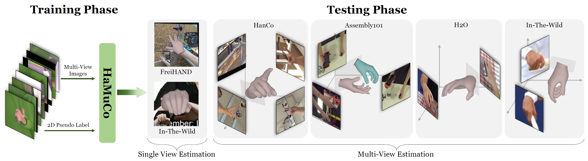

<div align="center">

<h1>HaMuCo: Hand Pose Estimation via Multiview Collaborative Self-Supervised Learning</h1>

<div>
    <a href='https://scholar.google.com/citations?user=3hSD41oAAAAJ' target='_blank'>Xiaozheng Zheng<sup>1,2†</sup></a>&emsp;
    <a href='https://scholar.google.com/citations?user=v8TFZI4AAAAJ' target='_blank'>Chao Wen<sup>2†</sup></a>&emsp;
    <a href='https://scholar.google.com/citations?&user=ECKq3aUAAAAJ' target='_blank'>Zhou Xue<sup>2</sup></a>&emsp;
    <a href='https://pengfeiren96.github.io/' target='_blank'>Pengfei Ren<sup>1,2</sup></a>&emsp;
    <a href='https://jericwang.github.io/' target='_blank'>Jingyu Wang<sup>1*</sup></a>
</div>
<div>
    <sup>1</sup>Beijing University of Posts and Telecommunications &emsp; <sup>2</sup>PICO IDL ByteDance &emsp; 
</div>
<div>
    <sup>†</sup>Equal contribution &emsp; <sup>*</sup>Corresponding author
</div>
<div>
    :star_struck: <strong>Accepted to ICCV 2023</strong>
</div>

---



<strong> HaMuCo is a multi-view self-supervised 3D hand pose estimation method that only requires 2D pseudo labels for training.</strong>

---

<h4 align="center">
  <a href="https://zxz267.github.io/HaMuCo/" target='_blank'>[Project Page]</a> •
  <a href="https://arxiv.org/abs/2302.00988" target='_blank'>[arXiv]</a>
</h4>

</div>

## :black_square_button: TODO

- [ ] FreiHAND evaluation code

- [ ] Multi-view inference code

## :mega: Updates

[07/2023] HaMuCo is accepted to ICCV 2023 :partying_face:!

[01/2023] Training and evaluation codes on HanCo are released.


## :file_folder: Data Preparation
### 1. Download the [HanCo](https://lmb.informatik.uni-freiburg.de/resources/datasets/HanCo.en.html) dataset from the official website.
  - https://lmb.informatik.uni-freiburg.de/data/HanCo/HanCo_rgb.zip
  - https://lmb.informatik.uni-freiburg.de/data/HanCo/HanCo_xyz.zip
  - https://lmb.informatik.uni-freiburg.de/data/HanCo/HanCo_shape.zip
  - https://lmb.informatik.uni-freiburg.de/data/HanCo/HanCo_calib_meta.zip
  - https://lmb.informatik.uni-freiburg.de/data/HanCo/HanCo_rgb_merged.zip
### 2. We provide the 2D pseudo labels generated from OpenPose in `./data/HanCo/HaMuCo_*.zip`.
### 3. Unzip files and organize the data as follows:
```
${ROOT}  
|-- data  
|   |-- HanCo
|   |   |-- calib
|   |   |-- rgb 
|   |   |-- rgb_2d_keypoints
|   |   |-- rgb_merged
|   |   |-- xyz
```


## :desktop_computer: Installation
### Requirements
- Python=3.7
- PyTorch=1.9.1+cu111
- torchgeometry (need some slight changes following [here](https://github.com/mks0601/I2L-MeshNet_RELEASE/issues/6#issuecomment-675152527).)

### Setup with Conda
```
conda create -n hamuco python=3.7
pip install torch==1.9.1+cu111 torchvision==0.10.1+cu111 torchaudio==0.9.1 -f https://download.pytorch.org/whl/torch_stable.html
cd HaMuCo
pip install -r ./requirements.txt
```

## :running_woman: Training
### 1. Run `./train.py` to train and evaluate on the HanCo dataset.

## :love_you_gesture: Citation
If you find our work useful for your research, please consider citing the paper:
```
@inproceedings{
  zheng2023hamuco,
  title={HaMuCo: Hand Pose Estimation via Multiview Collaborative Self-Supervised Learning},
  author={Zheng, Xiaozheng and Wen, Chao and Xue, Zhou and Ren, Pengfei and Wang, Jingyu},
  booktitle={Proceedings of the IEEE/CVF international conference on computer vision},
  year={2023}
}
```

## :newspaper_roll: License

Distributed under the MIT License. See `LICENSE` for more information.

## :raised_hands: Acknowledgements
The pytorch implementation of MANO is based on manopth. We thank the authors for their great job!
